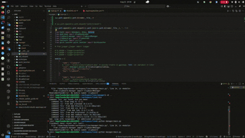

# 🐧 Lino

**Lino** is a Linux utility inspired by PowerToys — a single tray app that acts as the **central hub** for launching and controlling all modules like Clipboard Manager, Quick Launcher, and more.
Fast ⚡ lightweight 🎯 and fun 😄.

## 📖 Overview

- One tray icon runs in the background.
- Press a global shortcut (e.g., `Ctrl+Space`) to open the tray UI.
- Tray UI shows:

  - Fun messages or jokes
  - Buttons to launch modules
  - Shortcut keys info

- After launching a module, tray UI hides automatically.
- Press shortcut key again anytime to reopen the tray.

## ✨ Benefits

- Clean system: only one tray process.
- No clutter from multiple tray icons.
- Easy to extend modules.
- Fun, interactive, and user-friendly experience.

## ⚡ Functionalities & Shortcuts

| Functionality            | Description                       | Shortcut / Trigger      |
| ------------------------ | --------------------------------- | ----------------------- |
| Open Lino Tray UI        | Central tray window with options  | `Ctrl + Space` (global) |
| Launch Clipboard Manager | Start Clipboard Manager           | Button in Tray UI       |
| Launch Quick Launcher    | Start Quick Launcher              | Button in Tray UI       |
| Show Shortcut Keys       | Display shortcuts for all modules | Button in Tray UI       |
| Show Fun Message / Joke  | Random joke/emoji when tray opens | On tray open            |
| Exit Lino                | Quit the entire app               | Exit button in Tray UI  |

## 🖥️ How It Works

1. **Startup** → Tray app launches in background.
2. **Shortcut Pressed** → Tray UI pops up with welcome message + module buttons.
3. **Module Launch** → Click a module → tray hides → module opens.
4. **Repeat** → Press shortcut again to bring tray back.

## ⚙️ Technical Notes

- Tray app uses **PyQt5** with `QSystemTrayIcon`.
- Global shortcuts managed using system hooks (e.g., `pynput`).
- Modules run in separate windows, launched on demand.
- Tray UI shows daily jokes/emojis for engagement.
- Adding modules = just add buttons in tray config.

## 🎯 Recommended Shortcuts

| Module / Action          | Shortcut           | Why (UX & Safety)         |
| ------------------------ | ------------------ | ------------------------- |
| 🌐 Open Tray UI          | `Ctrl + Space`     | Easy, like Spotlight      |
| 📋 Clipboard Manager     | `Ctrl + Shift + V` | Natural for paste actions |
| 🚀 Quick Launcher        | `Alt + Space`      | Familiar (GNOME run)      |
| 🤖 AI Assistant (future) | `Ctrl + Shift + A` | “A” for assistant         |
| 📁 File Search           | `Ctrl + Shift + F` | Standard for find/search  |
| 🔎 App Search & Run      | `Alt + Shift + R`  | “R” for run               |
| 🎨 Theme Switcher        | `Ctrl + Shift + T` | “T” for theme             |
| 🐧 Pet / LOMY            | `Ctrl + Shift + P` | “P” for pet, playful      |
| ❌ Exit Lino             | `Ctrl + Shift + Q` | Standard quit             |

👉 All combos use `Ctrl+Shift+` or `Alt+Shift+` to avoid Linux DE conflicts.

## 🎥 Video Demo


<br>
[Watch full video](demo/demo.webm)

## 🛠️ Development & Packaging

```bash
# If AppDir is missing
appimage-builder --recipe AppImageBuilder.yml

# 1. Rebuild PyInstaller binary
pyinstaller --onefile --add-data "manager/mood:manager/mood" manager/main.py -n lino

# 2. Copy binary to AppDir
cp dist/lino AppDir/usr/bin/lino
chmod +x AppDir/usr/bin/lino

# 3. Build AppImage
appimage-builder --recipe AppImageBuilder.yml
```

## 🗺️ Roadmap

- Add more modules (Color Picker, Window Manager, etc.)
- Configurable shortcuts
- Better integration across desktop environments

## 📜 License

MIT License


added my shalini